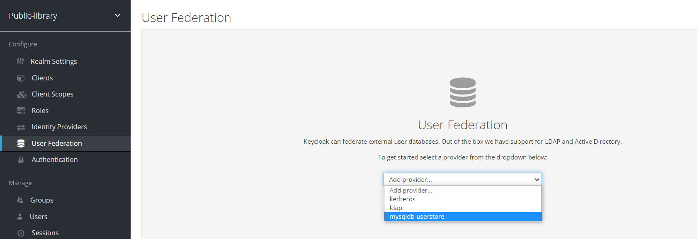
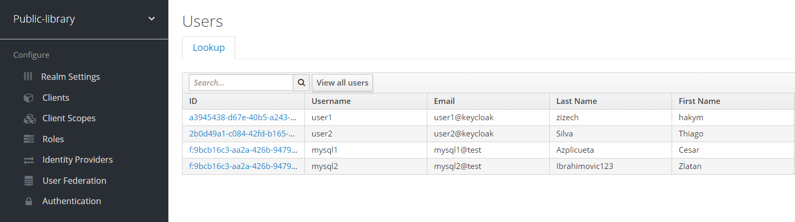

# Keycloak custom-user-storage
In this project, I will create a new user storage provider to connect with an external database (MySql).


### Reason
When using Keycloak, you can create a new user in User tab in Admin console. This user is stored in the local database of Keycloak. But in fact, organizations have existing database (ex mysql), it store informations of users (username, password, email, first_name, ...). But Keycloak have not available service for this. So if you need to use these information in Keycloak, you must create a new user storage provider.<br/>
For that reason, I will create a new provider to configure connection with mysql external db.

### Prepare install
* Keycloak
* MySql

### Create a new mysql database

```sql
CREATE DATABASE mysql-user-storage;

CREATE TABLE UserStore (
    id int primary key auto_increment,
    userName varchar(200),
    email varchar(200),
    passWord varchar(200),
    firstName varchar(20),
    lastName varchar(20)
);

INSERT INTO UserStore (userName, email, passWord, firstName, lastName)
values  ('mysql1', 'mysql1@keycloak', 'tung', 'Cesar', 'Azplicueta'),
        ('mysql2', 'mysql2@keycloak', 'tung', 'Zlatan', 'Ibrahimovic');
```

### Create a new user storage provider
You must be implement one or more this interfaces base on your case.

| Interfaces         | When need to implement  | 
| :-----:            | :-: | 
| UserStorageProvider | Always | 
| UserStorageProviderFactory | Always | 
| UserLookupProvider | if you want to be able to log in with users from this external store | 
| UserQueryProvider | if you want to view and manage users from the administration console | 
| UserRegistrationProvider | if your provider supports adding and removing users | 
| UserBulkUpdateProvider | if your provider supports bulk update of a set of users | 
| CredentialInputValidator | f your provider can validate one or more different credential types (ex password) | 
| CredentialInputUpdater | if your provider supports updating one or more different credential types | 

| UserQueryProvider | if you want to view and manage users from the administration console | 
In this project, I will implement 5 interfaces, they are `UserStorageProvider`, `UserStorageProviderFactory`, `UserLookupProvider`, `UserQueryProvider`, `CredentialInputValidator`

### Dive into some interfaces

```java
package org.keycloak.storage;

public interface UserStorageProvider extends Provider {
    /**
     * Callback when a realm is removed.  Implement this if, for example, you want to do some
     * cleanup in your user storage when a realm is removed
     *
     * @param realm
     */
    default
    void preRemove(RealmModel realm) {

    }
    ...

}
```

```java
package org.keycloak.storage;

public interface UserStorageProviderFactory<T extends UserStorageProvider> extends ComponentFactory<T, UserStorageProvider> {

    /**
     * This is the name of the provider and will be shown in the admin console as an option.
     *
     * @return
     */
    @Override
    String getId();

    /**
     * called per Keycloak transaction.
     *
     * @param session
     * @param model
     * @return
     */
    T create(KeycloakSession session, ComponentModel model);
...
}
```

```java
package org.keycloak.storage.user;

import org.keycloak.models.RealmModel;
import org.keycloak.models.UserModel;

public interface UserLookupProvider {
    UserModel getUserById(String var1, RealmModel var2);

    UserModel getUserByUsername(String var1, RealmModel var2);

    UserModel getUserByEmail(String var1, RealmModel var2);
}
```

```java
package org.keycloak.storage.user;

public interface UserQueryProvider {
    int getUsersCount(RealmModel var1);

    default int getUsersCount(RealmModel realm, boolean includeServiceAccount) {
        throw new RuntimeException("Not implemented");
    }

    List<UserModel> getUsers(RealmModel var1);

    List<UserModel> getUsers(RealmModel var1, int var2, int var3);

    List<UserModel> searchForUser(String var1, RealmModel var2);
    ...
}
```

### Package and Deployment
After complete implement these interface. We packaged in JAR and deployed to Keycloak.
```bash
mvn clean install

cp C:\Users\Tungdaigia\.m2\repository\com\custom-user-storage-impl\1.0.0\custom-user-storage-impl-1.0.0.jar C:\mytel\keycloak\keycloak-11.0.2\standalone\deployments\custom-user-storage-jpa.jar
```

### Add Mysql driver and Datasource
Download mysql-connector-java-{version}.jar.
Start jboss-cli
```bash
cd keycloak\bin
---windows
.\jboss-cli.bat

---linus
.\jboss-cli.sh
```

Add mysql connector
```bash
module add --name=com.mysql --resources=mysql-connector-java.jar --dependencies=javax.api,javax.transaction.api
```

Add mysql driver
```bash
/subsystem=datasources/jdbc-driver=mysql:add(driver-name=mysql, driver-module-name=com.mysql, 
driver-datasource-class-name=com.mysql.jdbc.Driver, driver-xa-datasource-class-name=com.mysql.cj.jdbc.MysqlXADataSource
)
```

Add mysql datasource
```bash 
/subsystem=datasources/xa-data-source=mysqlDS:add(driver-name=mysql, jndi-name=java:/mysqlDS, user-name={mysql username}, 
password={password}, use-java-context=true, use-ccm=true, pool-prefill=true, enabled=false, min-pool-size=3 , max-pool-size=10)

/subsystem=datasources/xa-data-source=UserStoreXADS/xa-datasource-properties=URL:add(value=jdbc:mysql://localhost:3306/mysql-user-storage)

xa-data-source enable --name=UserStoreXADS
```

### Start keycloak server
```bash
---windows
.\bin\standalone.bat

---linux
bin/standalone.sh
```

### Select new provider 

<div align="center">
    
</div>

All user in database display in User tab

<div align="center">
    
</div>


